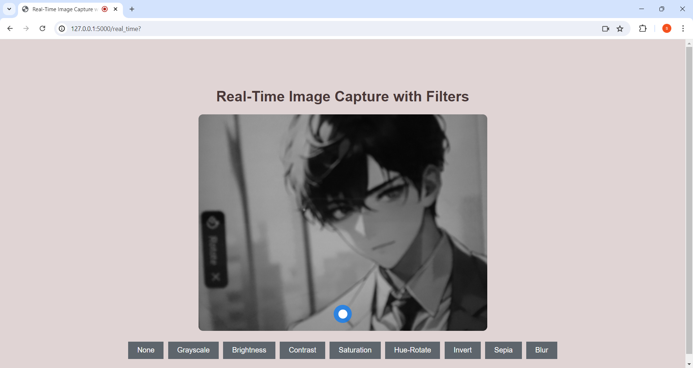

# Image Filter Application

Welcome to the **Image Filter Application**! This web-based app allows users to upload images and apply real-time filters to them, such as grayscale, sepia, brightness, and more.

## Features

- **Upload Image**: Users can upload images in formats like PNG, JPG.
- **Real-Time Filters**: Users can preview filters in real-time before applying them.
- **Apply Filters**: Choose from several filters, including brightness, contrast, sepia, and grayscale.
- **Save Filtered Image**: Save the filtered image to your local machine.
- **Photo Capture**: Capture photos directly from the camera with filters applied.

## Technologies Used

- **Backend**: Flask (Python)
- **Frontend**: HTML, CSS, JavaScript
- **Libraries**: OpenCV, PIL (Python Imaging Library)
- **Session Management**: Flask Sessions

## Application Flow

1. **Home Page**: Upload and apply filters to an image.
2. **Filter Page**: Choose filters and preview them live.
3. **Save Image**: Save the final image with the selected filter.
4. **Capture Image**: Capture a photo using the camera.

## Filters Available

- Grayscale
- Sepia
- Brightness
- Contrast
- Saturation
- Invert
- Blur
- Hue Rotation

## Screenshots

### 1. Home Page

### 2. Real-Time Filters

### 3. Capture Photo

## Future Enhancements

- Add more filters (e.g., cartoon, pixelate, etc.).
- Enhance the UI for a better user experience.
- Improve loading speed for large images.

## Contributing

Feel free to fork this project and submit pull requests. For major changes, open an issue to discuss your ideas.
